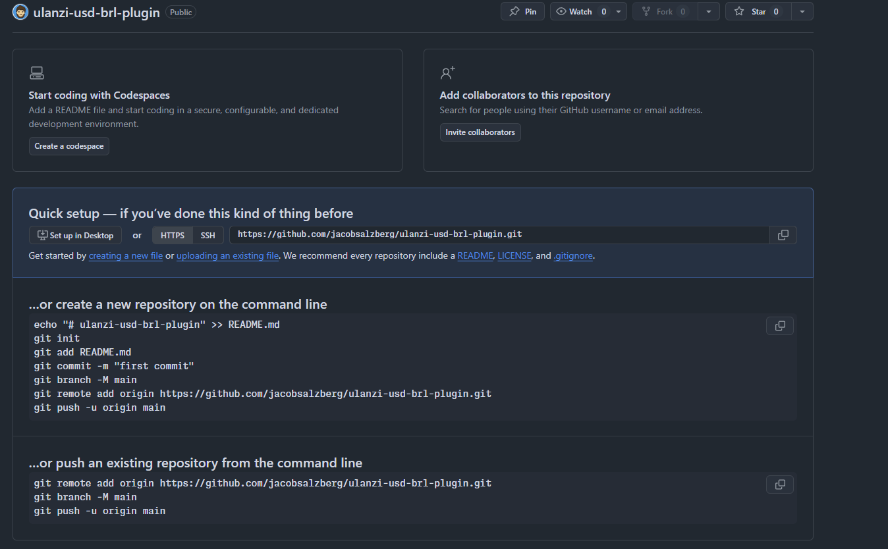

# 🚀 Como Subir o Plugin para o GitHub

## Passo 1: Criar o Histórico Git

Execute o script que criei:
```cmd
create-git-history.bat
```

Isso vai criar 11 commits com datas retroativas documentando toda a evolução do projeto desde outubro.

## Passo 2: Criar Repositório no GitHub

1. Acesse https://github.com/new
2. Nome do repositório: `ulanzi-usd-brl-plugin` (ou o que preferir)
3. Descrição: `USD/BRL Exchange Rate Plugin for Ulanzi Deck`
4. Escolha: **Public** ou **Private**
5. **NÃO** marque "Initialize with README" (já temos um)
6. Clique em **Create repository**

## Passo 3: Conectar e Fazer Push

Copie a URL do seu repositório (algo como `https://github.com/SEU_USUARIO/ulanzi-usd-brl-plugin.git`)

Execute estes comandos:

```cmd
cd com.ulanzi.usdbrlex.ulanziPlugin

git remote add origin https://github.com/SEU_USUARIO/ulanzi-usd-brl-plugin.git

git branch -M main

git push -u origin main
```

## Passo 4: Verificar

Acesse seu repositório no GitHub e você verá:
- ✅ 11 commits com histórico completo
- ✅ README.md na página inicial
- ✅ Toda a documentação
- ✅ Código fonte organizado

## 📋 Histórico de Commits Criado

1. **Oct 15** - Initial commit: Project structure
2. **Oct 20** - Basic plugin implementation
3. **Oct 25** - API integration
4. **Oct 28** - Canvas rendering
5. **Oct 30** - Documentation
6. **Nov 01** - Testing infrastructure
7. **Nov 02** - Auto-start feature
8. **Nov 03** - Bug fixes
9. **Nov 04 17:30** - Switch to SimpleAPI
10. **Nov 04 17:45** - Cache busting
11. **Nov 04 17:50** - Documentation updates

## 🔒 Dica de Segurança

Se você tiver informações sensíveis (tokens, senhas), crie um arquivo `.gitignore`:

```
# Ignore sensitive files
*.env
secrets/
private/
```

## 📝 Opcional: Adicionar Badges

Depois de subir, você pode adicionar badges no README.md:

```markdown


```

## 🎯 Pronto!

Seu plugin agora está no GitHub com todo o histórico documentado! 🎉
